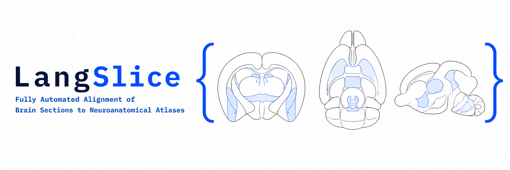

<p align="center">
  <picture>
    <source media="(prefers-color-scheme: dark)" srcset="assets/LangSlice_dark.png">
    <source media="(prefers-color-scheme: light)" srcset="assets/Langslice_light.png">
    
  </picture>
</p>

LangSlice registers histology slice images to BrainGlobe atlases. The active
runtime is the ADK-based harness in `src/langslice_harness/`, with a Tauri
desktop GUI in `tauri-gui/` and headless CLI support.

## Pipeline

`slice-position estimation -> image-gen registration -> Elastix B-spline -> QUINT/ABBA export`

1. Estimate the atlas position of the tissue slice. Coronal uses AP; sagittal
   and horizontal use their corresponding atlas-native axes.
2. Generate an atlas-colored registration target from the histology and atlas references.
3. Recover a dense deformation field with itk-elastix B-spline registration.
4. Warp the atlas and extract VisuAlign-compatible markers.
5. Export a QUINT/ABBA-compatible JSON file.

## Setup

1. Create the conda environment:
   `conda env create -f environment.yml`
2. Activate it:
   `conda activate langslice`
3. Install the harness in editable mode:
   `pip install -e .`
4. Configure authentication in `.env` using `.env.example`.

## CLI

```bash
# Single-slice position estimation
langslice estimate <image> [--atlas ...] [--model ...] [--workflow ...]

# Multi-slice group position estimation
langslice estimate-group <img1> <img2> ... [--interval 200] [--atlas ...]

# Whole-brain position estimation
langslice estimate-brain <image_folder> [--atlas ...] [--anchors ...]

# Image-gen registration at a known atlas position
langslice register <image> --position <mm> [--registration-mode direct|agentic] [--image-model ...] [--openai-image-route images|responses] [--review-model ...] [--max-candidates 3] [--out ...]

# Print package version
langslice version
```

## Registration

Registration is one pipeline now: image-gen registration. Direct mode generates
one candidate and returns it. Agentic mode wraps the same candidate generator in
an ADK review loop that can inspect up to three candidates before confirmation.

The registration result includes the model-generated atlas target, the
Elastix-warped atlas, and the warped atlas borders overlaid on the histology
slice for review.

## Authentication

`src/langslice_harness/vlm_config.py` supports:

- `ai_studio`
- `vertex_api_key`
- `vertex_adc`

Google image-generation models route through the Google provider adapter.
OpenAI image generation defaults to the Images API path for `gpt-image-2`;
the Responses `image_generation` route is opt-in. Flux models use the
OpenAI-compatible Images API path.

## Repository Layout

- `src/langslice_harness/` -- installable ADK harness package
- `models/` -- fine-tuned model projects and related assets
- `tauri-gui/` -- desktop app
- `tests/` -- pytest suite
- `docs/` -- maintained project docs
- `assets/` and `configs/` -- project assets and configuration
- `_local/` -- ignored local scratch, archives, and experiments

See `docs/index.md` and `REPO_MAP.md` for navigation.
