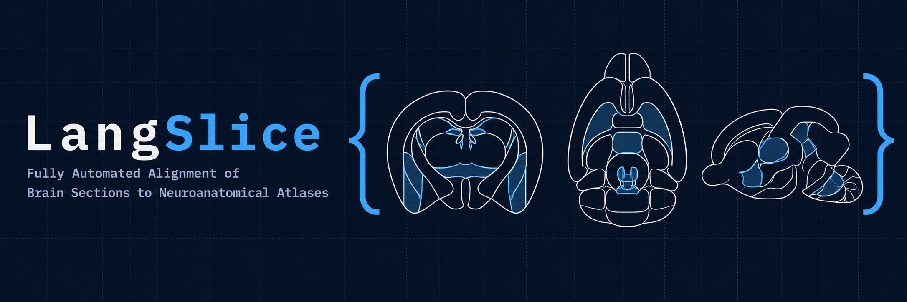
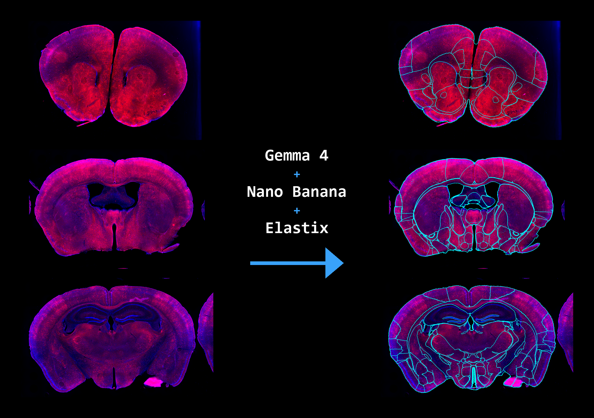
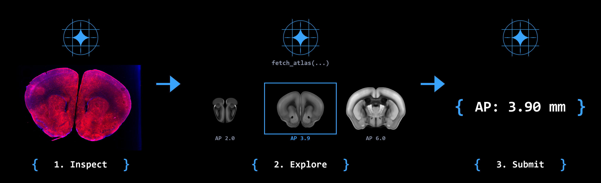
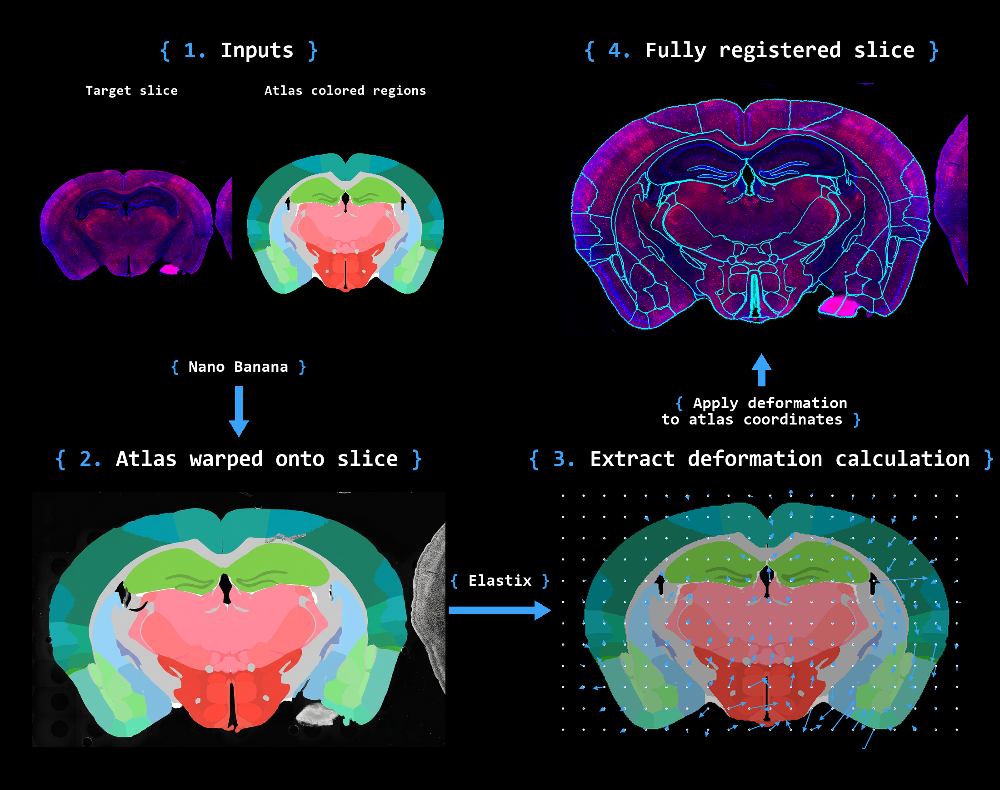

<p align="center">
  
</p>

<p align="center">
  <em>Register histological brain sections to BrainGlobe atlases.<br>
  A VLM estimates position, an image-gen model lays down atlas colors, Elastix warps the rest.</em>
</p>

<p align="center">
  
</p>

## How it works

<p align="center">
  
</p>

A VLM agent (default [`langslice-gemma-4-E4B`](https://huggingface.co/greenpolo/langslice-gemma-4-E4B))
inspects the slice, explores candidate atlas planes through tool calls, and
submits an AP coordinate. Image generation then produces an atlas-colored
target from the histology, and itk-elastix recovers a dense B-spline
deformation. Results export to VisuAlign-compatible JSON for QUINT / ABBA.

<p align="center">
  
</p>

## Quick start

```bash
conda env create -f environment.yml
conda activate langslice
pip install -e .
cp .env.example .env  # add AI Studio / Vertex / OpenAI keys
```

```bash
# Position estimation
langslice estimate slice.png

# End-to-end registration at a known atlas position
langslice register slice.png --position 3.9
```

Full CLI: `langslice --help`. Pipeline detail: [`docs/index.md`](./docs/index.md).

## Model Hub Transition

LangSlice is migrating training/data helpers into shared packages under `models/`:

- `models/langslice-traces/langslice_traces`
- `models/synthdata/synthdata`
- `models/training-core/langslice_training`
- `models/data/langslice_data`

Training entrypoints are exposed as small launchers:
`langslice-single-turn-rl`, `langslice-isft`, and `langslice-sft-train`.

Public model-card metadata for the released variant is in
`models/langslice-gemma-4/variants/langslice-gemma-4-e4b/README.md`.

## Links

- [**langslice-gemma-4-E4B**](https://huggingface.co/greenpolo/langslice-gemma-4-E4B) — the v1.0 fine-tune
- [**SliceBench**](./slicebench) — self-contained position-estimation benchmark
- [`tauri-gui/`](./tauri-gui) — desktop app
- [`docs/`](./docs) — full pipeline + harness internals
