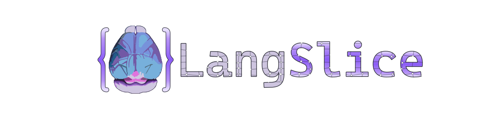

<p align="center">
  
</p>

LangSlice registers histology slice images to BrainGlobe atlases using Gemini vision-language models for estimation and itk-elastix for dense deformation recovery. The desktop GUI is a Tauri app (Rust + React + Three.js); the Python backend also runs headless via CLI.

## Pipeline

`AP estimation -> colored segmentation -> Elastix B-spline registration -> QUINT/ABBA export`

1. Estimate the anterior-posterior position of the tissue slice using Gemini tool-use or image-gen AP estimation.
2. Generate a colored segmentation of the tissue guided by atlas reference images (Gemini image-gen).
3. Extract a dense deformation field via itk-elastix B-spline registration on border images.
4. Warp the atlas through the recovered transform and extract VisuAlign-compatible markers from B-spline control points.
5. Export a single-slice QUINT/ABBA-compatible JSON file with anchoring vector and markers.

## Setup

1. Create the conda environment:
   `conda env create -f environment.yml`
2. Activate it:
   `conda activate langslice`
3. Install the package in editable mode:
   `pip install -e .`
4. Configure authentication in `.env` using `.env.example`.

## CLI

```bash
# AP estimation
langslice estimate <image> [--atlas ...] [--model ...] [--workflow ...]

# Registration at a known AP position
langslice register <image> --position <mm> [--workflow colored_segmentation] [--model ...] [--out ...]

# Print package version
langslice version
```

## Tauri GUI

The desktop application lives in `tauri-gui/` (Rust + React + Three.js). To launch:

```bash
cd tauri-gui && pnpm tauri dev
```

The GUI provides a 3D atlas viewer, pipeline sidecar for running AP estimation and registration, settings management, and split/overlay views.

## Authentication Backends

`langslice/ai/config.py` supports three backend modes, configured via `.env`:

- `ai_studio` (recommended for image-gen workflows)
- `vertex_api_key`
- `vertex_adc`

## Registration Workflows

Three registration workflows are available, selected by model capabilities or CLI `--workflow` flag:

- **`colored_segmentation`** (default for image-gen models) -- The model produces a colored segmentation of tissue anatomy guided by atlas reference images. Elastix B-spline registration extracts the dense deformation field. VisuAlign markers are derived from B-spline control points.
- **`image_gen_two_shot`** (legacy) -- Two-shot landmark workflow for image-gen models. Superseded by colored segmentation.
- **`multimodal_tool_loop`** (experimental, on hold) -- Iterative landmark refinement via tool calls for text-centric models.

## Debug Traces

Set `LANGSLICE_VLM_DEBUG_DIR` to save per-run artifacts.

- AP estimation writes the prepared target image, `reasoning.txt`, and `telemetry.json`.
- Registration writes a `registration/` subdirectory with atlas images, model output, border images, warped atlas, and `registration.json`.

## Repository Layout

- `langslice/` -- installable package source
- `tauri-gui/` -- Tauri desktop app (Rust + React + Three.js)
- `tests/` -- pytest suite
- `docs/` -- maintained project docs
- `references/` -- external reference code
- `archive/` -- preserved legacy material

See `docs/index.md` for the maintained docs set and `REPO_MAP.md` for the short navigation map.
