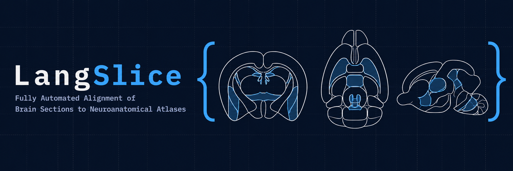
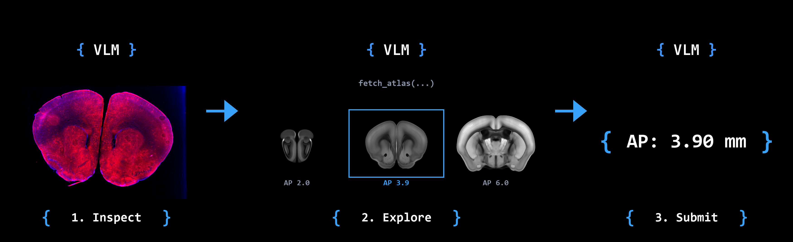
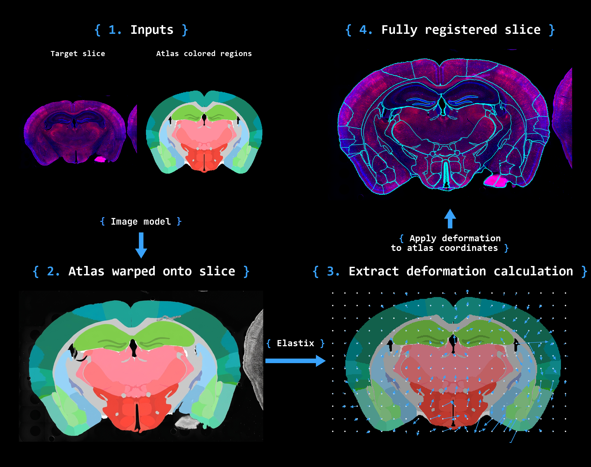

<p align="center">
  
</p>

<p align="center">
  <a href="https://github.com/greenpolo/LangSlice/blob/main/LICENSE"></a>
  <a href="https://www.python.org/downloads/"></a>
  <a href="https://github.com/greenpolo/LangSlice/actions/workflows/tests.yml"></a>
  <a href="https://langslice.readthedocs.io"></a>
  <a href="https://huggingface.co/greenpolo/langslice-gemma-4-E4B"></a>
</p>

<p align="center">
  <em>Register histological brain sections to BrainGlobe atlases.<br>
  A VLM estimates position, an image-gen model lays down atlas colors, Elastix warps the rest.</em>
</p>

> [!WARNING]
> LangSlice is in-development. Some atlases may produce mixed results; and
> horizontal and sagittal orientations haven't yet been thoroughly tested.
> LangSlice does not offer manual registration methods — it is meant to be
> used in combination with other registration software (ABBA, QUINT,
> PyNutil, BrainGlobe ecosystem, etc.). Export functions to these tools
> have not been fully developed yet.

<p align="center">
  
</p>

## How it works

<p align="center">
  
</p>

A VLM agent (default [`langslice-gemma-4-E4B`](https://huggingface.co/greenpolo/langslice-gemma-4-E4B))
inspects the slice, explores candidate atlas planes through tool calls, and
submits an AP coordinate. An image model is then handed the atlas region map
of that plane and asked to move its colored regions onto the tissue, and
itk-elastix recovers a dense B-spline deformation from the result. Results export to VisuAlign-compatible JSON for QUINT / ABBA.

<p align="center">
  
</p>

## Quick start

```bash
conda env create -f environment.yml
conda activate langslice
pip install -e .
cp .env.example .env  # add AI Studio / Vertex / OpenAI keys

# Optional: pre-download an atlas (~500 MB) into ~/.brainglobe/
python -c "from brainglobe_atlasapi import BrainGlobeAtlas; BrainGlobeAtlas('allen_mouse_25um')"
```

The CLI is grouped by method — `linear` for position estimation and affine
anchoring, `nonlinear` for generative-image registration:

```bash
# Linear: order, position and transform for a folder of sections
langslice linear run sections/

# Nonlinear: registration at a known atlas position
langslice nonlinear register slice.png --position 3.9
```

The two are independent. `nonlinear register` takes the position as an
argument, so it can follow `langslice linear run` or a placement made in
another tool — in QUINT/ABBA-style workflows it stands in for the manual
spline/BigWarp deformation step.

Full CLI: `langslice --help`. Pipeline detail: [`docs/index.md`](./docs/index.md).

## ABBA integration

LangSlice runs inside [ABBA](https://abba-documentation.readthedocs.io) as a
registration plugin: position slices however you like (DeepSlice, QuickNII
import, manual), then apply LangSlice's nonlinear registration from ABBA's
`Register` menu like any built-in method — undoable, saved in the ABBA state.

```bash
conda activate langslice
pip install -e ".[abba]"   # adds abba-python (needs the env's OpenJDK + Maven)
langslice abba             # launches the ABBA GUI with LangSlice installed
```

## Related Repositories

- **LangSlice-Training** — training infrastructure for LangSlice local models
  (SFT/RL pipelines, corpora, manifest tooling, docker training env).
- **SliceBench** — self-contained position-estimation benchmark.

Both depend on LangSlice; neither is required to run it.

## Links

- [**Documentation**](https://langslice.readthedocs.io) — full pipeline + harness internals
- [**langslice-gemma-4-E4B**](https://huggingface.co/greenpolo/langslice-gemma-4-E4B) — the v1.0 fine-tune

## Citation

If you use LangSlice in your work, please cite the project metadata in
[`CITATION.cff`](./CITATION.cff). GitHub renders a "Cite this repository"
button in the right sidebar from that file.

## License

BSD-3-Clause. See [`LICENSE`](./LICENSE).
