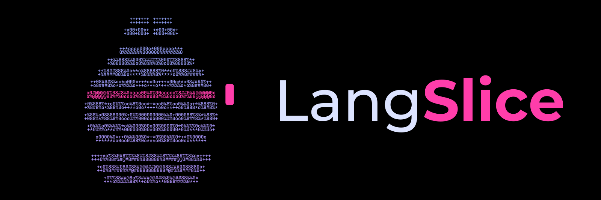
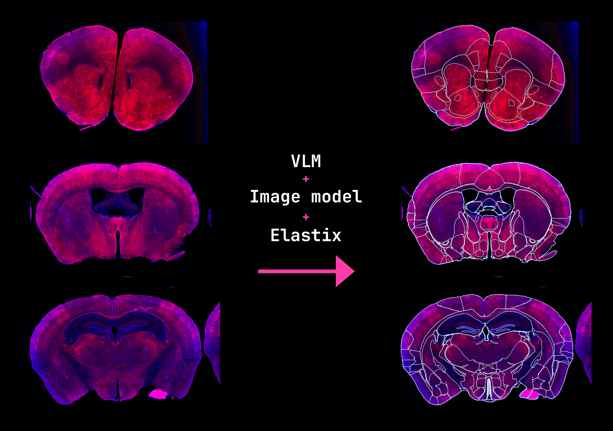

<p align="center">
  
</p>

<p align="center">
  <a href="https://github.com/greenpolo/LangSlice/blob/main/LICENSE"></a>
  <a href="https://www.python.org/downloads/"></a>
  <a href="https://github.com/greenpolo/LangSlice/actions/workflows/tests.yml"></a>
  <a href="https://langslice.readthedocs.io"></a>
</p>

<p align="center">
  <em>Register histological brain sections to BrainGlobe atlases.<br>
  A VLM agent orders, positions and aligns the sections; an image model corrects the atlas borders.</em>
</p>

> [!WARNING]
> LangSlice is in-development. Some atlases may produce mixed results; and
> horizontal and sagittal orientations haven't yet been thoroughly tested.
> LangSlice does not offer manual registration methods — it is meant to be
> used in combination with other registration software (ABBA, QUINT,
> PyNutil, BrainGlobe ecosystem, etc.). Export functions to these tools
> have not been fully developed yet.

<p align="center">
  
</p>

## How it works

A VLM agent looks at the whole stack of sections through tool calls: it puts
them in cutting order, places each one at its atlas position, and aligns each
in-plane against the atlas at true physical scale. An image model is then shown
the atlas borders drawn on the tissue at that placement and asked to correct
them. Turning corrected borders into a nonlinear deformation is still being
designed, so by default no deformation is fitted and the linear placement is
what gets exported; a deformable fit of the model's lines is available as an option (`fit_deformable`). Results
export to VisuAlign-compatible JSON for QUINT / ABBA. The registration stages are
illustrated in [the nonlinear design](docs/nonlinear_design.md), and the planned
user-facing options in [the interface design](docs/interface_design.md).

## Quick start

For the new **plugin in an existing Fiji/ABBA installation**, follow
[Install LangSlice in ABBA](docs/abba_installation.md). Setup and account login
are available inside ABBA. This is currently a source-build preview; the Fiji
update site and conda package are not yet published.

For command-line use, download and extract the source and open a terminal in
the folder containing `environment.yml`:

```bash
conda env create -f environment.yml
conda activate langslice
langslice login  # browser sign-in; optional when using account setup inside ABBA

# Optional: pre-download an atlas (~500 MB) into ~/.brainglobe/
python -c "from brainglobe_atlasapi import BrainGlobeAtlas; BrainGlobeAtlas('allen_mouse_25um')"
```

For API-key providers, use the Fiji setup dialog or copy `.env.example` to `.env`
and add your provider key. The environment file installs LangSlice itself and its
dependencies; an editable install is only needed for development.

Every step runs on one job folder: the agent run below, the agent CLI and
the Python library further down all read and write the same job.

```bash
# Linear: order, position and transform for a folder of sections
langslice linear run sections/

# Image-model border correction using the folder's saved linear alignment
langslice linear run sections/ --tasks nonlinear
```

The image tool uses the fixed border-correction prompt plus optional per-slice
agent notes. It retains the first result without agent rejection and returns raw
output plus extracted borders on the original. It currently produces annotation
images, with deformation fitting kept separate. See
[the image-tool contract](docs/nonlinear_image_tool.md).

The nonlinear step needs a linear placement first, made by the agent or
supplied with the job from another tool (`langslice job FOLDER init
--positions ... --transforms ...`): one image-generation call moves that
placement's drawn atlas borders onto the visible tissue — in QUINT/ABBA-style
workflows it stands in for the manual spline/BigWarp deformation step. The
model is never shown a colored atlas map, and no deformation is fitted unless
`fit_deformable` is called. See [the nonlinear design](docs/nonlinear_design.md).

For coding agents (Claude Code, Codex) and scripts, every agent tool is also
a command and a Python method on a job folder, under the same name: one JSON
answer per call on stdout, pictures as file paths, exit codes 0 / 2 / 3 / 4.
Each job folder carries a reference card (`AGENTS.md`, `CLAUDE.md`):

```bash
langslice job sections/ init --tasks position,transform   # the job folder, no agent run
langslice ops                                              # the verbs
langslice schema set_positions                             # one verb's arguments
langslice job sections/ set_positions --entries '[{"id": "s01.tif", "position_mm": 5.2}]'
langslice job sections/ fit_deformable --slices s01.tif --background   # then: wait
```

```python
import langslice
job = langslice.open_job("sections/")
job.status()
```

See [the agent CLI](docs/agent_cli.md). A scripted pipeline can run the image
model's border trace and the deformable fit without the agent, on one section or
a folder, with a model and prompt of its own:

```python
model = langslice.image_model("openai-oauth")   # or your own model + prompt file
result = langslice.register_section("s01.tif", position_mm=6.2, image_model=model)
result.sections[0].coords                       # atlas µm per pixel (coords.tif)
```

See [the Python library](docs/library.md).

Full CLI: `langslice --help`. Pipeline detail: [`docs/index.md`](./docs/index.md).

## ABBA integration

LangSlice works in [ABBA](https://abba-documentation.readthedocs.io) 0.24.x
through one integration: the [Fiji connector](connectors/fiji/README.md),
which adds **Register > LangSlice Registration…** to an existing ABBA
installation, with account setup under **Plugins > LangSlice > LangSlice
setup…** and inside the dialog. The dialog runs the agent on the selected
slices with the **Positioning**, **Linear** and **Nonlinear** tasks
(ChatGPT, or Claude through a copied prompt), per-slice damage marks,
channel preprocessing with a preview, and an estimated cost. LangSlice runs
as its own Python worker; every change the agent makes lands in ABBA live,
as an undoable step: positions, the in-plane affine, and with Nonlinear on a
warp step on top of it (sections that already carry your own warp are left
alone unless you allow the agent to overwrite existing transforms). See
[installation and supported sessions](docs/abba_installation.md).

`langslice abba` starts ABBA from Python (abba-python with ABBA 0.24.1's
Java libraries, Java 21) with the connector on its classpath, and adds two
passive companions to the connector's runs: the agent viewer (ABBA's own
positioning display plus focus panels of the sections the agent is working
on, without moving your camera or selection) and the agent log (a browser
window with the agent's text, provider reasoning summaries, tool cards and
the pictures it was shown, read from the job folder). Neither changes ABBA;
the connector applies every change.

```bash
conda activate langslice
pip install -e ".[abba]"                    # abba-python
(cd connectors/fiji && mvn package)         # the connector jar (Java 21)
langslice abba                              # or --connector-jar PATH, --no-viewer, --no-log
```

Importing images, saving or loading an ABBA state and exporting
registrations are ABBA's own commands; LangSlice does not wrap them.

## Related Repositories

- **LangSlice-Training** — training infrastructure for LangSlice local models
  (SFT/RL pipelines, corpora, manifest tooling, docker training env).
- **SliceBench** — self-contained position-estimation benchmark.

Both depend on LangSlice; neither is required to run it.

## Links

- [**Documentation**](https://langslice.readthedocs.io) — full pipeline + harness internals

## Citation

If you use LangSlice in your work, please cite the project metadata in
[`CITATION.cff`](./CITATION.cff). GitHub renders a "Cite this repository"
button in the right sidebar from that file.

## License

BSD-3-Clause. See [`LICENSE`](./LICENSE).
