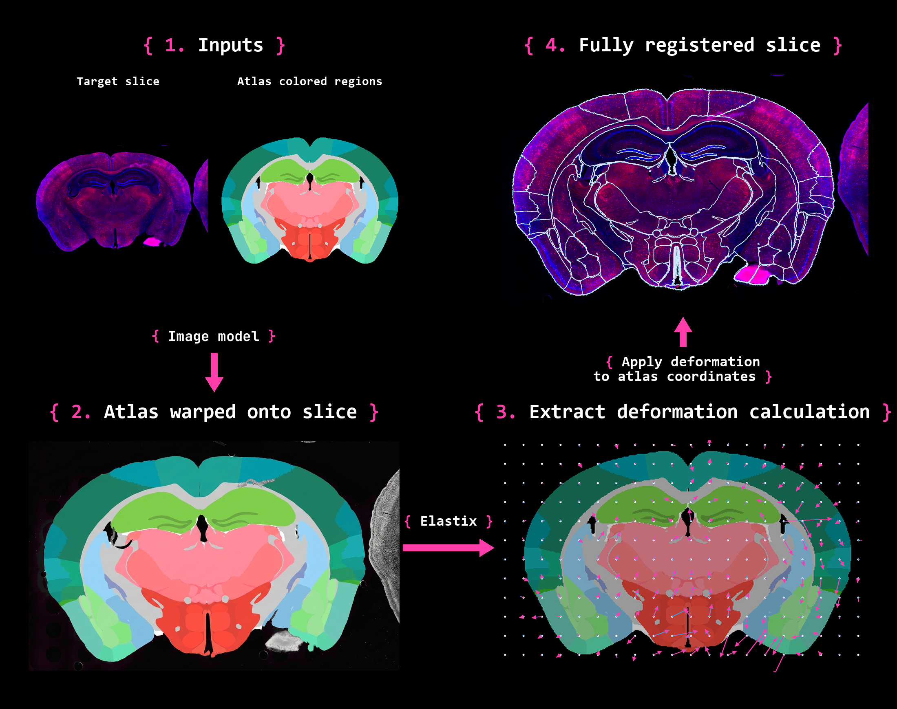

# Nonlinear registration: two border-based routes

The stack agent's supported image tool requires an existing linear placement and
uses the supplied-border correction task below. It accepts only a slice identifier
and an optional edited copy of the base prompt, retains the first image reply automatically, and
does not fit a deformation. See [the image-tool contract](nonlinear_image_tool.md).
The standalone lower-level atlas route described here remains available for
experiments; it is not exposed to the stack agent's correction tool. Route
"supplied" is the production path: nonlinear correction needs a linear
placement first, because the silhouette placement route "atlas" starts from is
broken by exactly the outline damage that matters most. Corrected borders
become a deformation through the shared deformable fit
(`langslice.core.deformable`, below), the same engine the linear agent's
`fit_deformable` uses; see also [the interface design](interface_design.md).

  

The figure shows the stages every route passes through: an input slice and
an atlas rendering, one image-model call that moves the atlas onto the
tissue, a residual fit of the model's output, and the deformation
applied to atlas coordinates. It predates the current design and shows the
model repainting a colored region map and an Elastix fit of it; the routes
below give it atlas borders instead, the model draws or corrects boundary
lines rather than fills, and the deformable package fits those lines.

Registration is exactly two border-based routes, selected automatically by
whether an initial atlas placement is supplied. Both routes fit the SAME
residual deformation to the model's lines and compose it with their own
initial placement.
There is no colormap workflow: an image model never repaints a colored atlas
region map, is never shown any colored atlas render, and no per-pixel
classification, multi-draw voting or RGB Elastix stage exists in this
package. BrainGlobe atlas colormaps vary too much in quality across atlases
to depend on.

## The two routes

| Route | Placement | Image-generation calls | What the model sees |
| --- | --- | --- | --- |
| "supplied" | `initial_atlas_to_slice` given | 1 | Image 1: tissue with the rough yellow family borders drawn on it. Image 2: the identical clean tissue. |
| "atlas" | none given | 1 (2 with `passes=2`) | Pass 1 — Image 1: clean tissue. Image 2: the outlined grayscale atlas template. Pass 2 (optional) — Image 1: clean tissue. Image 2: pass 1's lines redrawn on the tissue. Image 3: the outlined grayscale atlas template. |

Route "supplied" takes precedence whenever `initial_atlas_to_slice` is given.
Without it, `provider="none"` keeps its historical model-free diagnostic
(silhouette placement, zero model calls, zero residual). Any other provider
runs route "atlas": the rough placement is ALWAYS the local
silhouette-moments fit (`prior.place_plane_on_tissue_with_matrix`) — never a
remote call, since there is nothing yet to correct — and one or two model
calls draw or correct boundaries against it before the same fit that route
"supplied" uses.

A caller-supplied `generated_image` with no placement replays route "atlas"
with zero model calls: it is treated as that route's own final output.

## Route "supplied": correcting a placed border

1. The atlas plane is rendered at the requested position, plane and cutting
   angles, then warped onto the canvas by the supplied
   `initial_atlas_to_slice` affine (`cv2.warpAffine`, nearest-neighbor).
2. Its family-merged borders are drawn in thin yellow on the original
   histology (`border_refinement.border_overlay`); the identical clean
   histology is the second image.
3. One model call with `prompts.border_refinement_prompt(plane)` asks the
   model to slide or bend each line onto the tissue edge it belongs to,
   keeping already-correct lines and resolving indistinct boundaries from
   the supplied region arrangement.
4. Yellow lines are extracted from the raw reply
   (`border_refinement.extract_thinned_lines`: HSV threshold, crop back to
   the canvas aspect if the lane returned a different frame, Zhang-Suen
   thinning to a single-pixel skeleton) and displayed on the untouched
   original photograph — never on the model's redrawn tissue.
5. Optionally (`deformation="deformable"`), the
   deformable package fits the extracted lines
   (`border_fit.fit_border_lines`): route B, the line mask against the
   colour-family borders the model was shown, both softened by the same
   60 µm ridge, mean squares, Elastix B-spline at medium stiffness by default
   (`engine="ants"`: ANTs SyN with the lines also turned into named regions).
   The placement it fits on is the canvas placement as a
   `deformable.Placement` (`border_fit.placement_on_canvas`: the canvas
   pixel size follows from the placement's scale and the atlas resolution;
   `border_registration.native_to_oriented_map` folds `image_axes` and the
   mirror into the matrix, since the fit samples the native plane). The
   fitted atlas labels come from the composed map
   (`DeformableRecord.native_coordinates`) — never reconstructed from the
   yellow lines themselves — and the fitted borders are drawn smoothly on
   the canvas, clipped to tissue (`deformable.draw_warped_borders`).
   `deformation="none"` fits nothing: the residual is identity and the
   exported placement is the rough one; the model call is judged on its
   lines first. On a job, the fit is `fit_deformable`'s traced fit
   sections, on top of the section's linear placement. (Until 2026-10-04 this step was an Elastix borders
   B-spline or affine residual fit of its own, `"bspline"`/`"affine"`; the
   deformable package replaced it.)

## Route "atlas": drawing a border from nothing

1. `image_gen_registration.outlined_atlas_template` renders the plane's
   grayscale reference plate (contrast-stretched on the plate's own 99.5th
   percentile), oriented by `image_axes` then explicit `atlas_mirror_lr`
   (never inferred from a symmetric silhouette), upscaled to at least
   `MODEL_MAP_MIN_LONG_EDGE` (1024px) so thin bands stay legible, with its
   family-merged region borders drawn in thin yellow
   (`image_gen_helpers._extract_borders_from_classified` +
   `_overlay_borders`), then letterboxed to the section's own aspect. This
   is route "atlas"'s only atlas-facing model input — no colors, no filled
   regions.
2. Pass 1: one model call with `prompts.pass1_atlas_prompt(plane, provider)`
   — Image 1 the clean tissue, Image 2 the outlined atlas — asks the model
   to draw the atlas's boundaries onto the tissue from nothing, adapting
   shape and position to this specimen's anatomy and asymmetry, leaving out
   only tissue that is physically torn away or missing.
3. Optional pass 2 (`passes=2`): pass 1's lines are extracted
   (`extract_thinned_lines`) and redrawn on the clean tissue
   (`border_overlay`) to build a second reference image; one more model call
   with `prompts.pass2_atlas_prompt` — Image 1 clean tissue, Image 2 pass
   1's lines on the tissue, Image 3 the outlined atlas — corrects the lines
   three ways: remove a line with no counterpart in the atlas, leave a line
   off a slide feature (bubble, stain, debris), and nudge a line that has a
   counterpart but sits off its edge.
4. The resulting lines feed the SAME fit as route "supplied", with
   the silhouette-moments placement as the initial placement instead of a
   supplied one.

Pass 2 is optional. On clean coronal sections pass 1 alone produces a
complete partition and pass 2 moves lines by about a pixel; its value on
large sagittal and heavily damaged sections is untested.

Metadata for route "atlas" records `prior["source"] =
"silhouette_moments_atlas_route"`, top-level `passes` (1 or 2), and
`prior["atlas_route_model_calls"]` (0, 1 or 2 — 0 only on a
`generated_image` replay).

## Prompts

Prompt text lives in `core/nonlinear/prompts.py`: `border_refinement_prompt`
(route "supplied", unchanged wording since production acceptance),
`pass1_atlas_prompt` and `pass2_atlas_prompt` (route "atlas"). Provider
selection follows `canonical_provider(provider)`: names starting with
`"openai"` get the OpenAI GPT-image wording (roles by number and purpose,
"change only X" plus an explicit preserve list, exclusions allowed);
everything else gets the Google Gemini wording (positive framing only,
"change only X, keep everything else exactly the same"). `model_prompts.py`
now holds only canvas/aspect facts (`image_model_family`,
`aspect_ratio_limits`, `gemini_aspect_for`, `native_output_size`) — no
prompt text.

Rules the route-"atlas" prompts follow, and that any future prompt edit must
preserve: never write a visibility-conditioned rule ("no tissue, no line" or
"border what you see") — a visible slide feature must NOT get a line, and an
indistinct region MUST still get its atlas line, because the atlas image
alone decides which boundaries exist; the only stated exclusion is tissue
physically torn away or missing; every sentence is audited for alternative
interpretations before it is sent.

## Supplying a placement

`initial_atlas_to_slice` is a finite, invertible 3×3 affine mapping the
oriented native atlas annotation grid's pixel centers into pixels of the
supplied photograph. The atlas grid is sampled at the requested position and
cutting angles, then transformed by `image_axes` and the explicit
`atlas_mirror_lr` option; the matrix refers to that oriented grid.

`langslice.core.handoff.prepare_linear_registration` (re-exported by
`langslice.core.nonlinear.registration_handoff`) prepares this contract from an existing
linear section state; `registration_handoff.run_linear_registration`
performs the handoff, with the image model passed in
(`providers.registry.ImageModel`, resolved by the caller through
`resolve_image_model`). These are callable host interfaces, not an
automatically enabled tool in the linear agent's toolbox. The opt-in `nonlinear`
task adds a separate annotation-only `registration_tool` using the same prepared
linear geometry. The handoff functions preserve the
linear placement, including shear, physical calibration and section
orientation, without changing the linear state. Their image frame is the
oriented rendered section, not the original acquisition TIFF.

ABBA already provides aligned atlas-coordinate channels. Its adapter
(`hosts/integrations/abba.py`) draws those placed labels directly on the section
and uses the same route-"supplied" correction core and the same fit (the
labels sampled at ABBA's coordinates are the fit's native grid, placed by an
identity at the plugin's voxel size) — no standalone placement-free route or
silhouette refit in that adapter.

Do not infer left-right reflection from a nearly symmetric tissue silhouette.
Mirroring must be explicit and consistent for labels, grayscale anatomy and
reference maps (`atlas_mirror_lr`, one flag, applied identically everywhere
an atlas render is built). A correction request cannot reliably repair an
incorrectly specified atlas coordinate system.

## Geometry and coordinate contracts

Every route's final transform composes the initial placement (a supplied
affine, or the silhouette-moments affine on route "atlas") with the residual
border-fit deformation. Composition happens in
`border_registration.composed_correspondences` and `composed_native_map`:

- `composed_correspondences` samples the residual field every
  `marker_spacing_px` (1/36 of the long edge, at least 32 px) and
  returns two coordinate lists: `markers` (each slice pixel and the
  canonical letterboxed-atlas-canvas pixel it lands on, in VisuAlign's
  order `[x_overlay, y_overlay, x_image, y_image]`, the order the job
  folder's `exports/visualign.json` and SliceBench use) and `direct`
  (`[slice_x, slice_y, native_x, native_y]`, unambiguous atlas-grid
  coordinates).
  Both are reported in unpadded original-image pixel units.
- `composed_native_map` composes every residual sample with the initial
  placement to give a dense per-pixel native-atlas coordinate map
  (`atlas_coordinate_map` on the returned `RegistrationCandidate`).

Candidate metadata (`RegistrationCandidate.metadata`, written by
`generate_border_registration_candidate`) carries: `original_size`,
`target_size`, `unpadded_size`, `canvas_origin_px`, `canvas_pad`, `pad_px`,
`canvas_native`, `native_atlas_size`, `initial_atlas_to_slice`,
`initial_alignment_source` (default `"supplied"`; the top-level
`registration_handoff` bridge passes `"linear_agent"`; no placement plus
`provider="none"` sets `"silhouette_moments"`; no placement with an active
provider — route "atlas" itself — sets
`"silhouette_moments_atlas_route"`),
`passes`, `deformation`, `fit` (the deformable fit's settings, engine,
diagnostics and flags, or `{"fit": "none", "fit_skipped": true}`),
`fit_elapsed_s`, `atlas_to_canvas`, `slice_to_canvas`,
`native_atlas_to_canonical_canvas`, `visualign_markers` + `n_markers`,
`marker_frames` (the exact composition formula, in prose), and
`slice_to_native_atlas_correspondences` +
`native_correspondence_columns`. `prior` records how the rough placement was
obtained (`source`, `automatic`, `sign_pattern`, `silhouette_iou`, and, on
route "atlas", `atlas_route_model_calls`). `inverse_warp_status` is always
`"not_computed"` — neither route currently produces a histology-to-atlas
inverse render.

Resize rounding, padding and pixel-center offsets are tracked through
`pixel_center_map` / `canonical_atlas_map` and retained in both axes; nothing
in the composition drops a rounding term silently.

## Review artifacts

`generate_border_registration_candidate` keeps these separate, both in the
returned `RegistrationCandidate` and (with `debug_dir` set) on disk:

- the rough border overlay on the original photograph
  (`rough_border_overlay.png`);
- the untouched raw model reply (`raw_correction.png` /
  `generated_segmentation.png` — the same image; the compatibility name now
  holds the raw border-correction reply, not a color map);
- extracted model borders drawn on the original photograph
  (`corrected_border_overlay.png` / `generated_border_overlay.png`);
- the fitted atlas labels rendered as a colored RGB map purely for human
  review (`warped_atlas.png`, built by `image_gen_helpers._classified_to_rgb`
  from the atlas package's `color_lut` — this colored render is never shown
  to the image model on either route) and its borders over the same
  photograph (`warped_border_overlay.png`);
- the residual deformation field, the rough/warped label arrays and the
  composed native-atlas coordinate map (`residual_field.npz`,
  `rough_leaf_ids.npz`, `warped_leaf_ids.npz`, `atlas_coordinate_map.npz`);
- `meta.json` and `fit_report.json` (the deformable fit's mechanical
  diagnostics: per-region area ratios, folds, displacement, and flags only
  when the warp is physically implausible; anatomical quality is still a
  human visual call, never a metric verdict), plus the fit's
  `DeformableRecord` saved under `deformable/`.

Read `output_kind` and `workflow` metadata rather than assuming a color-map
image is present anywhere in this pipeline.

## Deformable fit engine (`langslice.core.deformable`)

A shared top-level package holds the library fit that corrected borders (or
the stain itself) go through. The linear agent reaches it through
`fit_deformable` (task `nonlinear`, `core/deformation.py`): the stain's
fit appearance against ara/nissl, or the `trace_borders` lines
(`traced_borders` = label-map mode, `traced_lines` = lines vs borders)
against borders, include/exclude regions (optionally one side,
`"CTX:left"`), sequential `start="current"` steps, preview candidates vs one applied
setting; the engine is the user's `nonlinear.engine` choice or the agent's.
Applied records are saved under `<results dir>/deformable/` and referenced from
`SliceState.deformation`; the job folder's maps and VisuAlign markers read them
(`docs/file_formats.md`); ABBA and BrainGlobe adapters are not built. The standalone routes above and the ABBA plugin
fit the model's lines through it (`core/nonlinear/border_fit.py`). `fit_section(image, atlas, placement, settings,
lines=..., previous=..., native=...)` takes a `Placement` — the handoff's
`atlas_to_slice` or the image tool's `atlas_to_canvas`, unchanged; `native`
replaces the atlas plane with a host's own label grid — and
returns a `DeformableRecord`; `fit_candidates` runs up to eight settings in a
process pool.

| Choice | Options |
| --- | --- |
| engine | `ants` (SyN, optional `registration` extra, own inverse) or `elastix` (B-spline + bending penalty, inverse by fixed-point approximation) |
| section image | `stain` (against `ara`/`nissl`; `stain_metric` local correlation, 80 µm window, by default, Elastix's stand-in mutual information, or mutual information; `stain_edges` adds a gradient-magnitude edge channel, on by default) or `lines`: the model's extracted lines (mean squares, against `borders`/`borders_merged`); the crossed pairings are refused |
| atlas image | `ara` (BrainGlobe reference), `nissl` (ABBA's cached Allen Nissl, ABBA hosts only), `borders`, `borders_merged` (the family set the image model is shown) |
| labels (ANTs only) | `model`: the model's enclosed areas named by placed-region overlap; `auto`: tissue footprint and empty holes near placed ventricles (the linear tool's ANTs stain default) |
| stiffness / detail | soft/medium/firm and coarse/standard, in physical units (the linear tool runs standard) |
| other | `exclude` (acronyms or ids, descendants included, optionally one side of the section: `"CTX:left"`), `structures` + `neighbourhood_um` (a sequential step composed onto `previous`), `preprocess` (ANTs N4, denoise); line softening is fixed at 60 µm |

Masks: tissue widened past its outline, minus a band along torn edges (outline
lying well inside the placed atlas footprint); the atlas footprint minus
excluded regions, which are also blanked for every image kind. The record's
field points section → placed atlas in millimetres (`atlas = section +
field`), composes with the placement as `composed_native_map` does, carries
warped labels clipped to tissue and reports, never enforces, per-region area
ratios from the Jacobian, folds and loose/strict limits for ventricles/tissue,
and `DISPLACEMENT_OUTSIZED` (largest displacement above a tenth of the
tissue's extent, or median above 0.6 mm). The 2026-10-01 ceiling test set
these choices: no `stiff` level, detail and line softening fixed, the stain
against borders refused; on its fluorescent sections the Nissl reference's
outer edge sat 40-80 µm inside the tissue's bright surface rim, where ara
followed the edge. The 2026-10-02 stain ceiling test chose the stain
defaults by eye: local correlation (interior lines follow visible structure
better than mutual information), an edge channel (fixes ventricles and a
midline slit that correlation alone missed), and in the linear tool the
automatic tissue/ventricle labels (continuous outline, enlarged ventricles
filled). Fits are deterministic: fixed seed and a fixed thread count
(`engines.FIT_THREADS`), identical inputs give identical fields.
Details: `src/langslice/core/deformable/CLAUDE.md`.

## Review and limits

Inspect the raw reply first, then the extracted boundaries on the original
tissue, then the fitted atlas overlay. A good model correction can still be
degraded by its subsequent fit. Metrics and fit-report codes complement
these separate visual checks; neither fit success nor agreement with a
reference proves anatomical correctness.

One draw per model call is supported. The yellow-line extractor can confuse
naturally saturated yellow tissue with drawn lines. Boundary fitting is not
region-identity-aware and does not certify topology. Route "atlas" needs an
explicit `atlas_mirror_lr`; nothing infers reflection from the tissue.
Neither route currently computes an inverse (atlas-to-histology) render.
These remain review considerations, not claims that every visually
excellent reply transfers perfectly to atlas labels.
